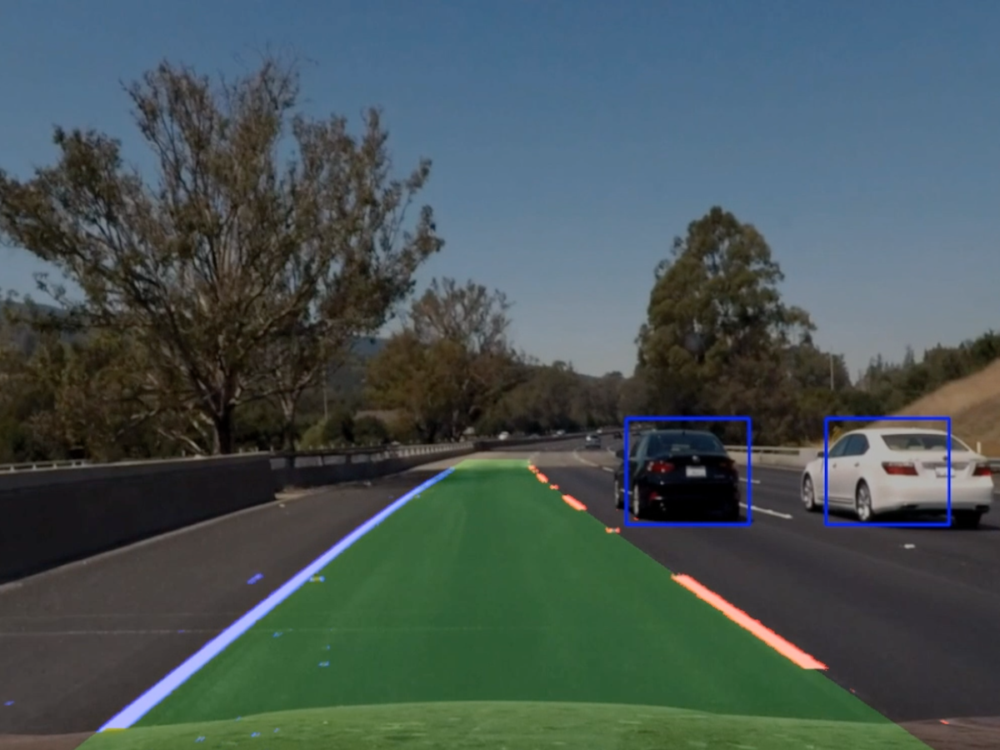

# Vehicle Detection Project

[//]: # (Image References)
[image1]: ./examples/car_not_car.png
[image2a]: ./examples/HOG_example_car.png
[image2b]: ./examples/HOG_example_noncar.png
[image3]: ./examples/all_search_windows.png
[image4a]: ./examples/find_cars_test6.png
[image4b]: ./examples/find_cars_test3.png
[image4]: ./examples/sliding_window.jpg
[image5a]: ./examples/bboxes_and_heat_1.png
[image5b]: ./examples/bboxes_and_heat_2.png
[image5c]: ./examples/bboxes_and_heat_3.png
[image5d]: ./examples/bboxes_and_heat_4.png
[image5e]: ./examples/bboxes_and_heat_5.png
[image5f]: ./examples/bboxes_and_heat_6.png
[image6]: ./examples/labels_map.png
[image7]: ./examples/output_bboxes.png
[video1]: ./output_videos/project_video_output.mp4


## Overview

This repo contains the code written to complete the fifth project on [Udacity Self-Driving Car Nanodegree Program](https://www.udacity.com/course/self-driving-car-engineer-nanodegree--nd013) (Term 1). This project uses computer vision and maschine learning to find cars on a video stream.

## Histogram of Oriented Gradients (HOG)

The code for this step is contained in code cell 6 of the IPython notebook located in [`Pipeline.ipynb`](Pipeline.ipynb).

I started by reading in all the `vehicle` and `non-vehicle` images (code cell 2). Here is an example of one of each of the `vehicle` and `non-vehicle` classes (from code cell 4; see also code cell 5):

![Example images][image1]

I then explored different color spaces and different `skimage.hog()` parameters (`orientations`, `pixels_per_cell`, and `cells_per_block`). I grabbed random images from each of the two classes and displayed them to get a feel for what the `skimage.hog()` output looks like.

Here is an example using the `YCrCb` color space and HOG parameters of `orientations=9`, `pixels_per_cell=(8, 8)` and `cells_per_block=(2, 2)`:

![HOG with car][image2a]
![HOG without car][image2b]

I tried various combinations of parameters. The following tests were made using the fixed HOG parameters `Orientations = 9`, `Pixels per Cell = 8`, and `Cells per Block = 2`. The purpose of this fixed test was to determine the best-fitting `Color Space`.

| Color Space | HOG Channel     | Accuracy                      |
|:-----------:|:---------------:|:-----------------------------:|
| RGB         | 0 / 1 / 2 / ALL | 95.5% / 96.0% / 93.5% / 96.0% |
| HLS         | 0 / 1 / 2 / ALL | 97.5% / 93.0% / 89.0% / <span style="color:blue">99.5%</span> |
| HSV         | 0 / 1 / 2 / ALL | 94.0% / 94.0% / 94.5% / 98.5% |
| LUV         | 0 / 1 / 2 / ALL | 93.0% / 96.5% / 94.0% / 99.0% |
| YUV         | 0 / 1 / 2 / ALL | 94.0% / 94.0% / 97.5% / 98.0% |
| YCrCb       | 0 / 1 / 2 / ALL | 95.5% / 98.5% / 97.0% / <span style="color:blue">99.5%</span> |

Further experimentation using HLS and YCrCb color space showed that the following HOG parameters work best on the training and test data (see [`Pipeline.ipynb`](Pipeline.ipynb), code cell 13):

| Parameter         | Value     |
|:-----------------:|:---------:|
| Color Space       | `YCrCb`   |
| Orientation       | `9`       |
| Pixels per Cell   | `8`       |
| Cells per Block   | `2`       |
| HOG Channel       | `ALL`     |
| Spatial Size      | `(32,32)` |
| Histogram Bins    | `32`      |
| Spatial Feature   | `True`    |
| Histogram Feature | `True`    |
| HOG Feature       | `True`    |

I trained a linear SVM using 80% of the data as training data (see [`Pipeline.ipynb`](Pipeline.ipynb), code cell 16).

```python
# Use a linear SVC
svc = LinearSVC()
svc.fit(X_train, y_train)
```

It took 6.08 seconds to train the linear SVM.

## Sliding Window Search

I decided to search window positions at different scales. As illustrated in code cells 22-25 of the IPython notebook located in [`Pipeline.ipynb`](Pipeline.ipynb), a maximum of 374 search windows is used to find cars on the image. The following image contains a plot of all 374 search windows randomely colored for better visualization.

![All search windows][image3]

The `find_cars_on_street()` function is holding everything together (see [`Pipeline.ipynb`](Pipeline.ipynb), code cell 26) and uses the previously declared `find_cars()` function (see [`Pipeline.ipynb`](Pipeline.ipynb), code cell 19).

Ultimately I searched on four scales (`1.0`, `1.5`, `2.0`, and `3.0`) using YCrCb 3-channel HOG features plus spatially binned color and histograms of color in the feature vector, which provided a nice result. Here are some example images:

![Example 1: Search Windows][image4a]
![Example 2: Search Windows][image4b]

## Video Implementation

Here's a [link to my video result](./output_videos/project_video_output.mp4)

I recorded the positions of positive detections in each frame of the video using the `Detector` class (see [`Pipeline.ipynb`](Pipeline.ipynb), code cell 37). From the positive detections I created a heatmap (see [`Pipeline.ipynb`](Pipeline.ipynb), code cell 28) and then thresholded that map (see [`Pipeline.ipynb`](Pipeline.ipynb), code cell 30) to identify vehicle positions. I then used `scipy.ndimage.measurements.label()` to identify individual blobs in the heatmap. I then assumed each blob corresponded to a vehicle. I constructed bounding boxes to cover the area of each blob detected (see [`Pipeline.ipynb`](Pipeline.ipynb), code cell 33).

Here's an example result showing the heatmap from a series of frames of video, the result of `scipy.ndimage.measurements.label()` and the bounding boxes then overlaid on the last frame of video:

![Frame 1: Search Windows and Heatmap][image5a]
![Frame 2: Search Windows and Heatmap][image5b]
![Frame 3: Search Windows and Heatmap][image5c]
![Frame 4: Search Windows and Heatmap][image5d]
![Frame 5: Search Windows and Heatmap][image5e]
![Frame 6: Search Windows and Heatmap][image5f]

![Output of scipy.ndimage.measurements.label()][image6]

![Resulting bounding boxes][image7]

## Discussion

I had a big problem with hundreds of false positives, even though the system looked quite right. I spent many hours investigating this issue and finally found the error in a parameter I changed in the `skimage.feature.hog()` function call.

```
/Users/*/miniconda3/envs/carnd-term1/lib/python3.5/site-packages/skimage/feature/_hog.py:119:
skimage_deprecation: Default value of `block_norm`==`L1` is deprecated and will be changed to `L2-Hys` in v0.15
```

Due to this warning and the fact, that I was using a version > v0.15, I deciced to add the parameter `block_norm='L2-Hys'` to the function call. Besides making every step in the pipeline noticeably slower (Feature Extraction as well as Linesar SVM training and prediction), it also created massive false positives. Removing this parameter finally solved my problem and improved performance massively.

Further improvements:
* Processing the project video takes a lot of time. This is because I improved the car search nearly to the maximum. I guess there is a better trade-off between accuracy and performance, that I still have to find.
* Since there is a perspective of the street on the images, there is no need to search at the top corners of the bottom half of the image. Fewer search windows should increase performance as well.
* More information could be used from previous frames to improve the robustness of the process even further.
